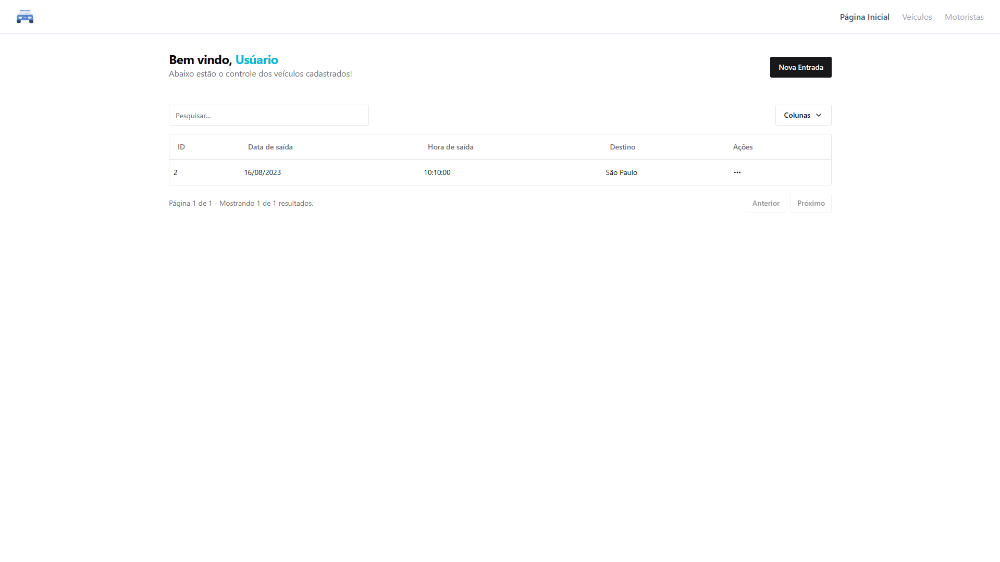
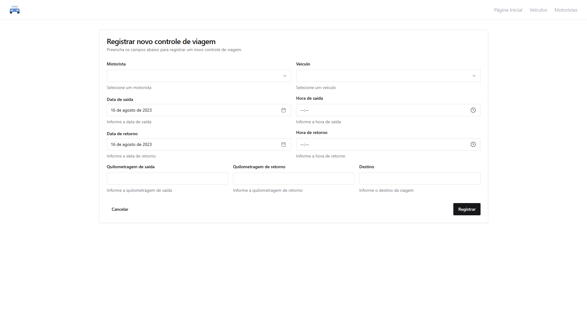
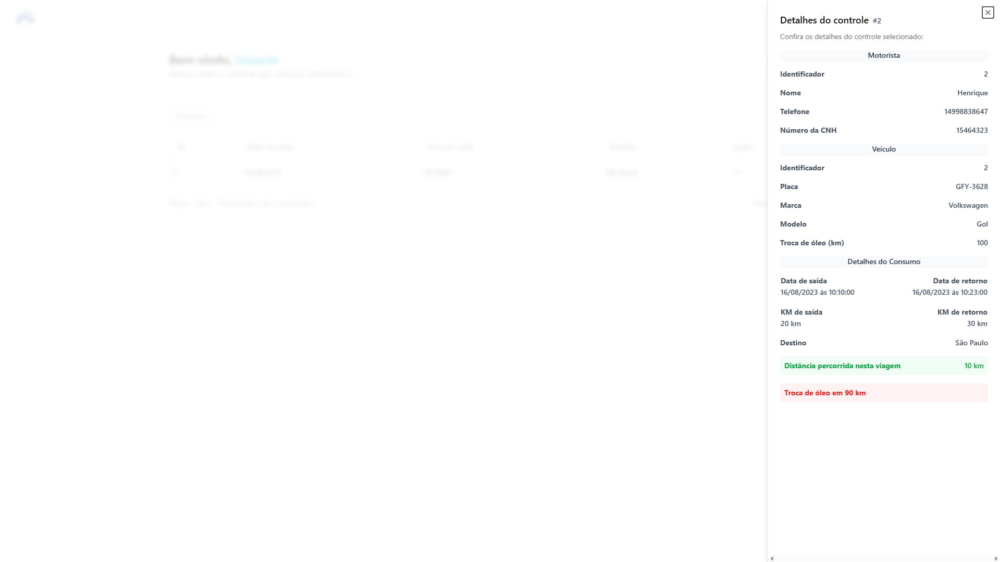

## Telas do sistema

### Página Inicial

Esta é a página inicial do sistema, onde você pode acessar as principais funcionalidades, como cadastrar um novo controle de veículos, consultar os controles existentes.

### Página de Cadastro de Controle de Veículos

Nesta página, você pode registrar um novo controle de veículos, informando os dados do veículo, do motorista, da origem e do destino da viagem, e os gastos.

### Página Detalhes do Controle

Nesta página, você pode visualizar os detalhes de um controle de veículos selecionado.

